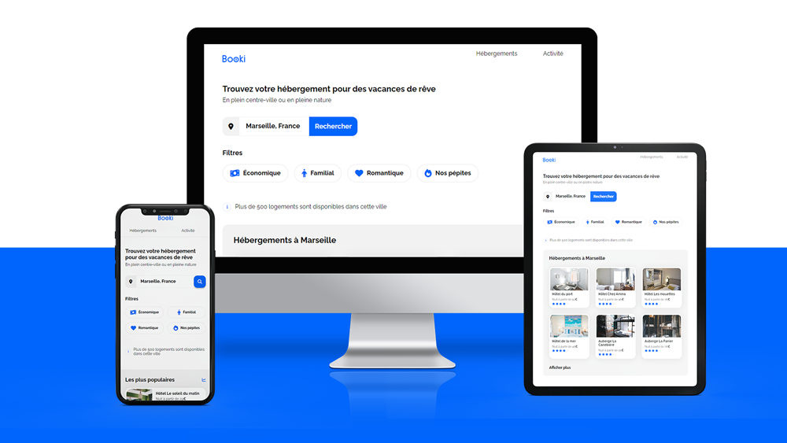

# Openclassrooms - **Projet 2** : Transformez une maquette en site web avec HTML & CSS

Sarah, la CTO de **Booki**, m'a communiqué que les maquettes du site sont prêtes et m'attend pour passer à l'action. Loïc, l'UI designer, et elle ont concocté une note de synthèse qui détaille tout ce dont j'ai besoin : spécifications, fonctionnalités à intégrer, et les contraintes techniques à ne pas rater.

## Table des matières

- [Openclassrooms - **Projet 2** : Transformez une maquette en site web avec HTML \& CSS](#openclassrooms---projet-2--transformez-une-maquette-en-site-web-avec-html--css)
  - [Table des matières](#table-des-matières)
  - [Aperçu](#aperçu)
    - [Screenshot](#screenshot)
    - [Liens](#liens)

## Aperçu

### Screenshot

### Liens

-   Code du site : [GitHub](https://github.com/stephanievanoverberghe/booki)
-   Site en direct : [GitHub Pages](https://stephanievanoverberghe.github.io/booki/)
